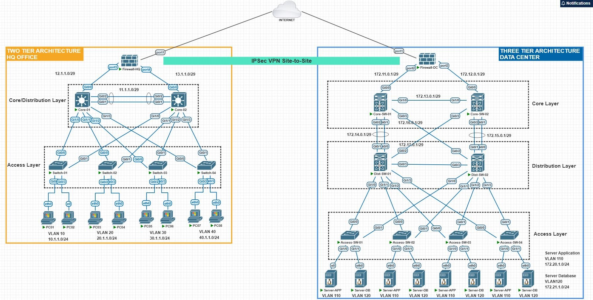

# HQ–DC Network Automation (Two‑Tier HQ + Three‑Tier DC)

This repository is an **Ansible-based network automation solution** for the topology in the diagram:

- **HQ Office** – two-tier (Core/Distribution + Access)
- **Data Center** – three-tier (Core + Distribution + Access)
- **IPsec VPN Site-to-Site** between HQ and DC firewalls

The design is:

- **Idempotent** – uses Ansible network modules, not raw CLI where possible.
- **Data‑driven** – all device-specific data is in `host_vars/` and `group_vars/`.
- **Production-style** – base / L2 / L3 / security separated into roles.

> ⚠️ You **must** lab‑test and adapt IPs, passwords, and policy to your real environment before touching production.

---

## Topology

The credit of this topology goes to Randy Pratma Putra (https://www.linkedin.com/in/randy-pratama-putra/)

## Watch the Video on YouTube
[](https://youtube.com/@ehsanmomeni007?si=WN-tooMzS_Ki6bDZ)

## 1. Requirements

- Python 3.10+
- Ansible 2.16+
- Cisco IOS / IOS-XE on switches and routers
- Cisco ASA/FTD for firewalls (VPN role is a skeleton to be adapted)

Install collections:

```bash
ansible-galaxy collection install -r requirements.yml
```

---

## 2. Inventory Overview

Groups (from `inventory/hosts.yml`):

- `hq_core` – Core-01, Core-02
- `hq_access` – Switch-01…Switch-04
- `dc_core` – Core-SW01, Core-SW02
- `dc_dist` – Dist-SW01, Dist-SW02
- `dc_access` – Access-SW01…Access-SW04
- `firewalls` – Firewall-HQ, Firewall-DC

Each host has its own `host_vars/<hostname>.yml` file describing:

- VLANs & SVIs
- L3 links (`/29` interconnects as per the diagram)
- Access ports (for PCs/Servers)
- Trunks (for uplinks)
- IGP (OSPF) and default route

---

## 3. Roles

- `base` – hostname, domain, NTP, syslog, SNMP, timezone
- `layer2` – VLANs, access interfaces, trunk interfaces
- `layer3` – SVIs, routed interfaces, OSPF, static default route
- `vpn_firewall` – hostname + inside/outside interface config, with a **clear TODO** for IPsec policy

Roles are intentionally small and composable so they can be easily extended (QoS, port‑channels, security, etc.).

---

## 4. Playbooks

- `playbooks/hq.yml` – Applies `base`, `layer2`, `layer3` to HQ core; `base`, `layer2` to HQ access.
- `playbooks/dc.yml` – Applies roles to DC core, distribution, access.
- `playbooks/firewalls.yml` – Applies firewall base + IP interface config.
- `playbooks/site.yml` – Orchestrator that imports all of the above.

Example usage:

```bash
# Dry run with diffs
ansible-playbook playbooks/site.yml -C --diff

# Actual deployment
ansible-playbook playbooks/site.yml
```

---

## 5. Security & Policy

This repo **does not** hardcode sensitive credentials:

- Username is set in `inventory/hosts.yml`.
- Password is taken from the environment variable `NET_PASSWORD`.

Example:

```bash
export NET_PASSWORD='YourStrongPassword!'
ansible-playbook playbooks/site.yml
```

SNMP communities, NTP, syslog, and domain name are in `group_vars/all.yml`.  
Adapt these to your org standards (SNMPv3, TACACS/RADIUS, etc.) before production.

---

## 6. Testing Hooks

Under `tests/` you’ll find placeholders for:

- `pyATS` – for VLAN, OSPF, and routing validation.
- `Batfish` – for pre‑change routing policy analysis.

These are not fully implemented (they depend on your tooling), but the structure is ready to plug into CI/CD.

---

## 7. Safety Checklist Before Going Live

1. Clone this repo to a **lab** environment.
2. Replace mgmt IPs in `inventory/hosts.yml` with your real device IPs.
3. Adjust VLAN IDs, subnets, and OSPF areas if your implementation differs.
4. Run:

   ```bash
   ansible-lint
   ansible-playbook playbooks/site.yml -C --diff
   ```

5. Validate end‑to‑end reachability and routing.
6. Only then run without `-C` in a change window.

This is a **production‑style** repository: structure, idempotency, and separation of concerns are ready; just adapt the data and any local standards (AAA, logging, naming conventions, etc.).
